# Algoritmos — RodoviaMonitor Pro

> Este documento descreve os algoritmos e lógicas internas do sistema, com fluxogramas em Mermaid.
> Para o contexto de arquitetura veja [ARQUITETURA.md](ARQUITETURA.md).
> Para análise detalhada de precisão veja [ANALISE_PRECISAO.md](../ANALISE_PRECISAO.md).

---

## Índice

1. [Normalização de rotas](#1-normalização-de-rotas)
2. [Coleta paralela e chunking](#2-coleta-paralela-e-chunking)
3. [HERE: corridor vs bbox](#3-here-corridor-vs-bbox)
4. [Downsampling RDP (Ramer-Douglas-Peucker)](#4-downsampling-rdp-ramer-douglas-peucker)
5. [Correlação de status e ocorrência](#5-correlação-de-status-e-ocorrência)
6. [Detecção de conflito entre fontes](#6-detecção-de-conflito-entre-fontes)
7. [Cálculo de confiança — DataAdvisor](#7-cálculo-de-confiança--dataadvisor)
8. [Estimativa de KM e trecho local](#8-estimativa-de-km-e-trecho-local)
9. [Classificação de trânsito Google](#9-classificação-de-trânsito-google)
10. [Classificação de fluxo HERE — Jam Factor](#10-classificação-de-fluxo-here--jam-factor)

---

## 1. Normalização de rotas

**Arquivo:** `main.py` — `_normalizar_rota_logistica(rota)`

Converte cada entrada do `rota_logistica.json` (formato `routes`) para o formato interno usado pelo sistema durante a coleta.

### Fluxograma

```mermaid
flowchart TD
    entrada["Entrada: rota do rota_logistica.json\n(routes[])"]
    temHere{Tem campo\nhere.origin/destination?}
    usaHere["origem/destino = here.origin / here.destination\n(string lat,lng)"]
    temLatLng{Tem lat/lng\nno hub?}
    usaLatLng["origem/destino = 'lat,lng'\n(coordenadas do hub)"]
    usaStr["origem/destino = str(orig/dest)\n(fallback texto)"]
    temNome{tem nome\norigem e destino?}
    retNone["return None\n(trecho ignorado)"]
    montaSegs["Monta segmentos com pontos_referencia:\norigem (km=0) + via[] + destino (km=distancia)"]
    temVia{Tem waypoints\nvia[] em here?}
    kmVia["KM estimado = distance_km * (i+1)/(n+1)\nse não: (i+1)*10 km"]
    montaTrecho["Saída: trecho interno\n{nome, origem, destino, rodovia, sentido, tipo,\nconcessionaria, segmentos, via_waypoints, limite_gap_km}"]

    entrada --> temHere
    temHere -->|Sim| usaHere
    temHere -->|Não| temLatLng
    temLatLng -->|Sim| usaLatLng
    temLatLng -->|Não| usaStr
    usaHere --> temNome
    usaLatLng --> temNome
    usaStr --> temNome
    temNome -->|Não| retNone
    temNome -->|Sim| montaSegs
    montaSegs --> temVia
    temVia -->|Sim| kmVia
    temVia -->|Não| montaTrecho
    kmVia --> montaTrecho
```

### Campos de saída (trecho interno)

| Campo | Conteúdo |
|-------|----------|
| `nome` | "HubOrigem -> HubDestino" |
| `origem` / `destino` | string `"lat,lng"` ou endereço |
| `rodovia` | `" / ".join(rodovia_logica)` |
| `segmentos` | lista de `{km, lat, lng, local}` (pontos_referencia) |
| `via_waypoints` | lista de `(lat, lng)` dos pontos intermediários |
| `limite_gap_km` | limite para identificação de trecho local (opcional) |

---

## 2. Coleta paralela e chunking

**Arquivo:** `main.py` — `executar_coleta()`, `_coletar_fonte()`

O orquestrador dispara as três fontes em paralelo usando `ThreadPoolExecutor`. A HERE Traffic aplica um chunking adicional para respeitar rate limits.

### Fluxograma do ciclo completo

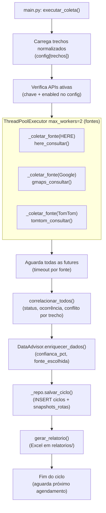

### Chunking HERE

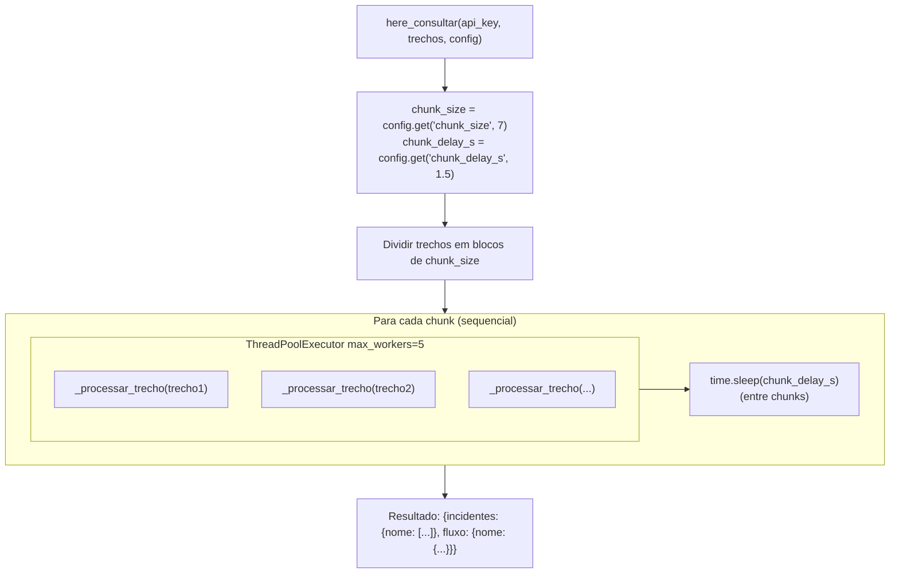

> O chunking sequencial entre blocos garante que a HERE API não seja sobrecarregada.
> Dentro de cada chunk, os trechos são processados em paralelo (max 5 workers).

---

## 3. HERE: corridor vs bbox

**Arquivo:** `sources/here_traffic.py` — `_obter_corridor_ou_none()`, `consultar_incidentes()`

A HERE Traffic API aceita dois métodos de filtro espacial: **corridor** (polyline precisa) e **bbox** (retângulo aproximado). A escolha impacta diretamente a precisão dos dados.

### Fluxograma de decisão

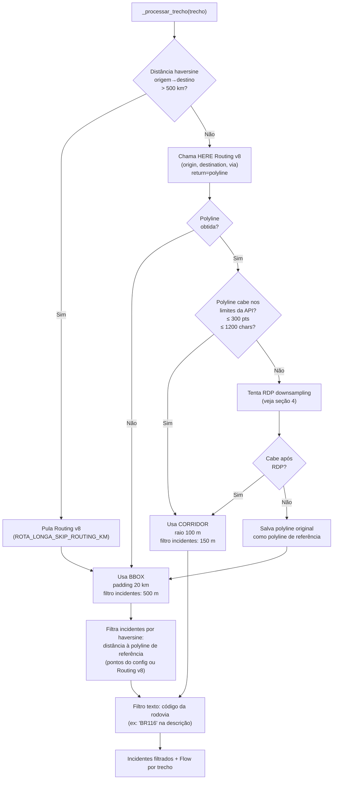

### Comparativo corridor × bbox

| Aspecto | Corridor | BBox |
|---------|----------|------|
| % de rotas (atual) | ~25% | ~75% |
| Filtro espacial | 150 m da polyline | 500 m da polyline de referência |
| Precisão | Alta | Média |
| Quando usado | Rotas < 500 km com polyline < 300 pts | Demais casos |
| Risco | Incidentes fora da rota | Incidentes em vias adjacentes < 500 m |

---

## 4. Downsampling RDP (Ramer-Douglas-Peucker)

**Arquivo:** `sources/here_traffic.py` — `_rdp_simplify()`, `_downsample_polyline()`

Quando a polyline do Routing v8 excede 300 pontos ou 1200 caracteres, o RDP é aplicado iterativamente para reduzir pontos preservando a geometria (curvas, inflexões).

### Algoritmo

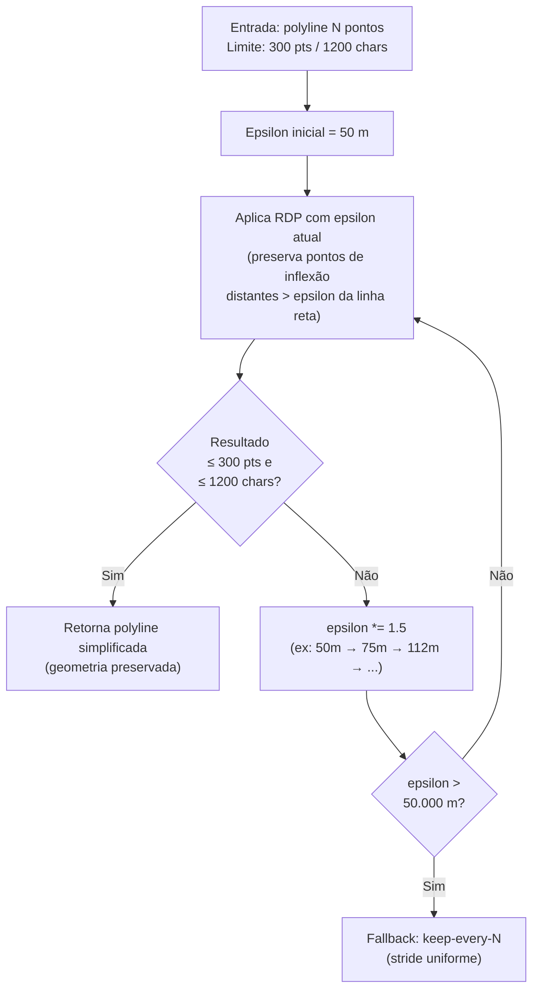

> **Por que RDP e não stride fixo?** O stride remove pontos uniformemente, podendo simplificar uma curva a uma linha reta. O RDP prioriza pontos geometricamente significativos (ex.: entrada de trevo, curva de serra), resultando em corridor mais preciso com menos pontos.

---

## 5. Correlação de status e ocorrência

**Arquivo:** `sources/correlator.py` — `correlacionar_trecho()`

Combina os dados das três fontes em um único status e ocorrência por trecho, aplicando regras de prioridade e promoção.

### Fluxograma de status

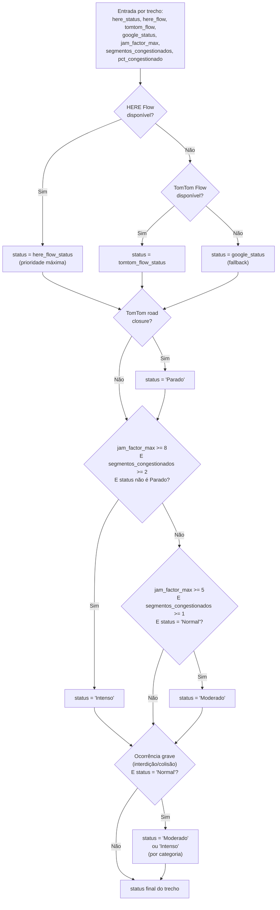

### Fluxograma de ocorrência

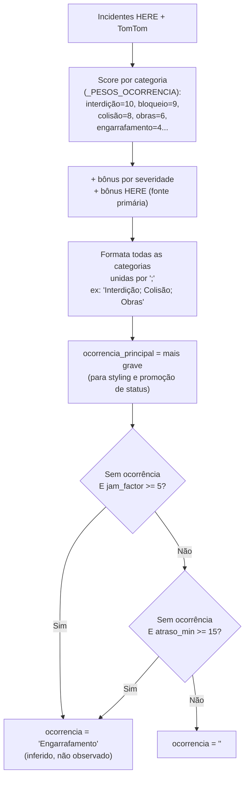

---

## 6. Detecção de conflito entre fontes

**Arquivo:** `sources/correlator.py` — `_detectar_conflito_fontes()`

Quando HERE e Google divergem significativamente na avaliação de tráfego, o sistema sinaliza conflito e penaliza a confiança.

### Mapeamento de níveis

| Status | Nível numérico |
|--------|---------------|
| Normal | 0 |
| Moderado | 1 |
| Intenso | 2 |
| Parado | 3 |
| Sem dados | — (ignorado) |

### Fluxograma

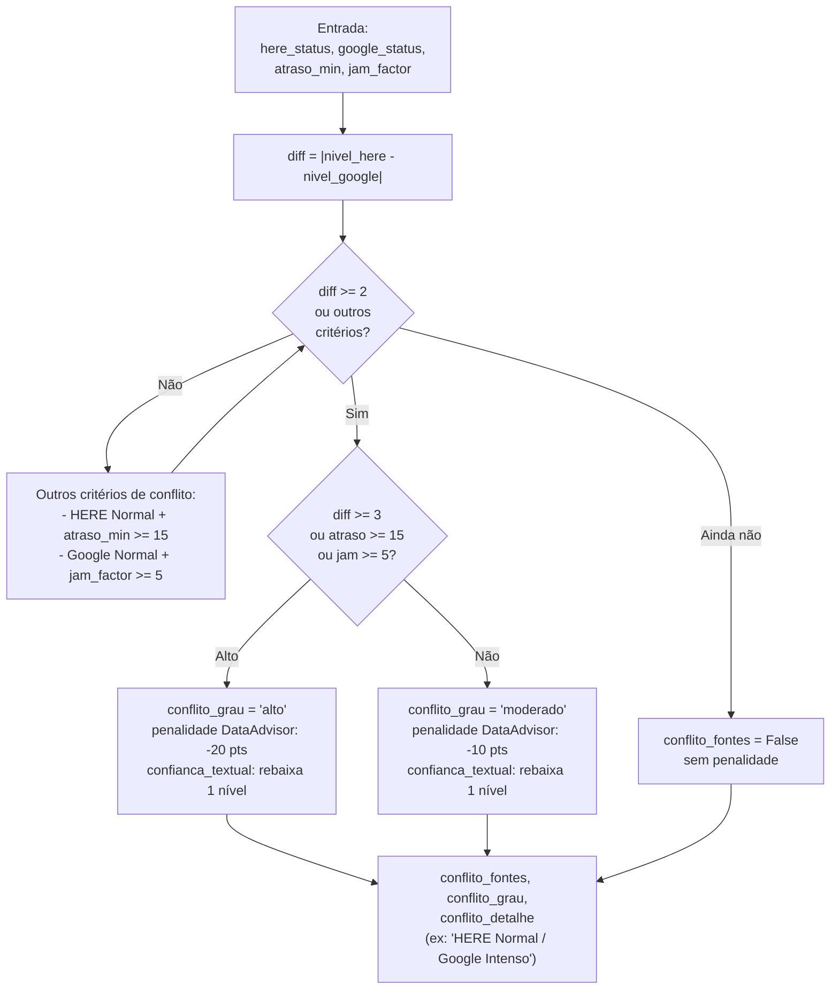

---

## 7. Cálculo de confiança — DataAdvisor

**Arquivo:** `sources/advisor.py` — `DataAdvisor.enriquecer_dados()`

O `DataAdvisor` calcula `confianca_pct` (0–100) combinando frescor dos dados (freshness), peso por fonte e score operacional.

### Diagrama de blocos

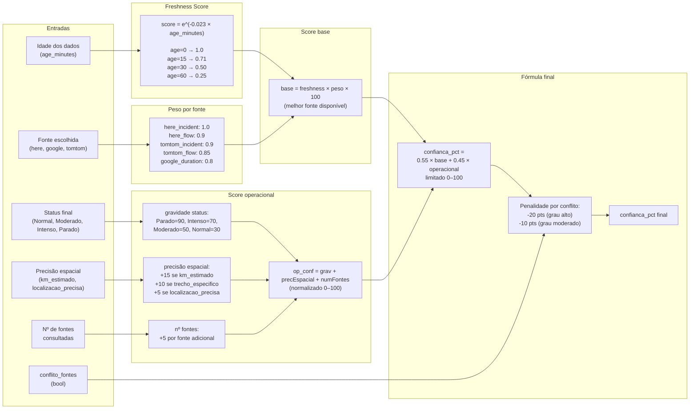

### Confiança textual

| `confianca_pct` | Confiança textual |
|-----------------|------------------|
| ≥ 70 | Alta |
| 40–69 | Média |
| < 40 | Baixa |

> Quando há conflito de fontes (diff ≥ 2 níveis), a confiança textual é rebaixada em 1 nível (Alta → Média → Baixa), independente do valor numérico.

---

## 8. Estimativa de KM e trecho local

**Arquivo:** `sources/km_calculator.py` — `estimar_km()`, `identificar_trecho_local()`

Estima o KM de um incidente ao longo da rodovia usando interpolação geográfica pelos pontos de referência.

### Fluxograma

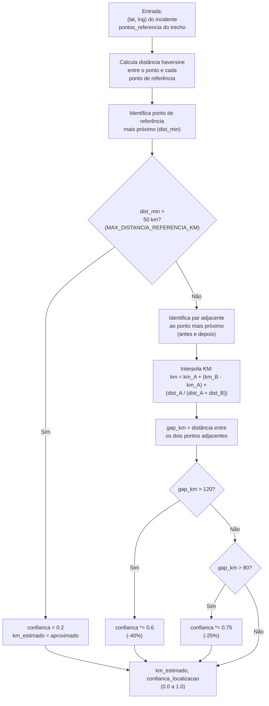

### Identificação de trecho local

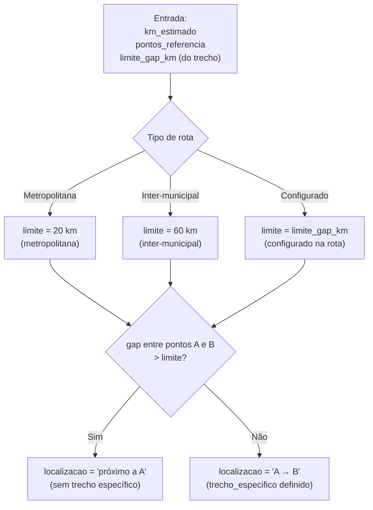

> **Limitação:** a distância é calculada em linha reta (haversine), não ao longo da rodovia. Em trechos sinuosos (ex.: BR-040 Serra de Petrópolis), o erro pode ser de ±10–20 km.

---

## 9. Classificação de trânsito Google

**Arquivo:** `sources/google_maps.py` — `classificar_transito()`

Combina razão de duração e atraso absoluto para classificar o status de cada rota.

### Lógica

```python
razao = duracao_transito / duracao_normal
atraso_min = (duracao_transito - duracao_normal) / 60

# Thresholds de razão
THRESHOLDS_RAZAO = {"Normal": 1.15, "Moderado": 1.40}

# Thresholds de atraso absoluto (requerem razão mínima)
THRESHOLDS_ATRASO_ABS = {
    "Moderado": {"min_atraso_min": 10, "min_razao": 1.03},
    "Intenso":  {"min_atraso_min": 25, "min_razao": 1.05},
}
```

### Exemplos práticos

| Rota | Duração normal | Duração c/ trânsito | Razão | Atraso | Status |
|------|---------------|--------------------|----|--------|--------|
| Curta (30 min) | 30 min | 36 min | 1.20 | 6 min | **Moderado** (razão > 1.15) |
| Longa (300 min) | 300 min | 315 min | 1.05 | 15 min | **Moderado** (atraso ≥ 10 + razão > 1.03) |
| Longa (300 min) | 300 min | 325 min | 1.08 | 25 min | **Intenso** (atraso ≥ 25 + razão > 1.05) |
| Longa (300 min) | 300 min | 310 min | 1.03 | 10 min | **Normal** (razão abaixo de 1.15, atraso abaixo de 10 min) |

---

## 10. Classificação de fluxo HERE — Jam Factor

**Arquivo:** `sources/here_traffic.py` — `consultar_fluxo_trafego()`

O Jam Factor (0–10) é calculado pela média dos segmentos de fluxo, com análise adicional por segmento para evitar que congestionamentos localizados sejam diluídos.

### Thresholds (média)

| Jam Factor médio | Status base |
|-----------------|-------------|
| 0 – 2.0 | Normal |
| 2.1 – 5.0 | Moderado |
| 5.1 – 8.0 | Intenso |
| 8.1 – 10.0 | Parado |

### Promoção por segmento (correlator)

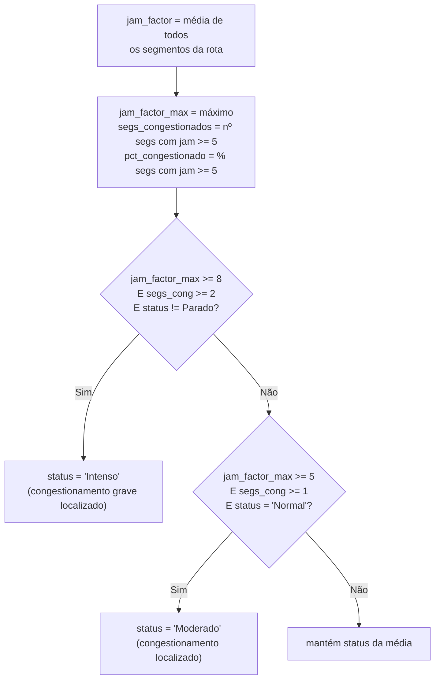

**Exemplo real (BR-381):** 50 km congestionados (jam=8) + 380 km livres (jam=0.5) → média 1.37 → status "Normal" **sem** promoção. Com promoção: `jam_factor_max=8`, `segs_congestionados=5` → status **"Intenso"**.

---

## Documentação relacionada

- [ARQUITETURA.md](ARQUITETURA.md) — visão do sistema e componentes
- [PRECISAO_E_CONFIANCA.md](PRECISAO_E_CONFIANCA.md) — gaps e % de confiança
- [ANALISE_PRECISAO.md](../ANALISE_PRECISAO.md) — análise técnica detalhada
- [COMO_FUNCIONA.md](COMO_FUNCIONA.md) — guia de apresentação do sistema
