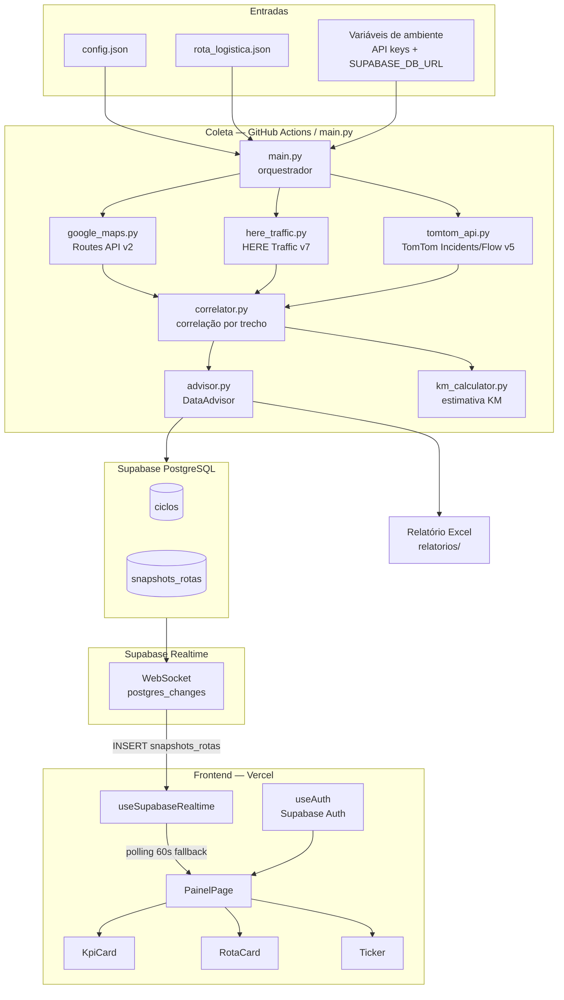
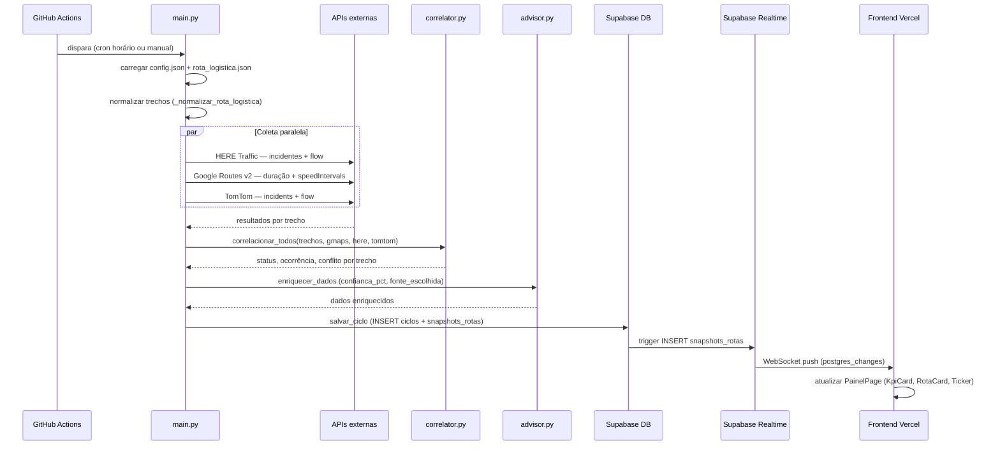
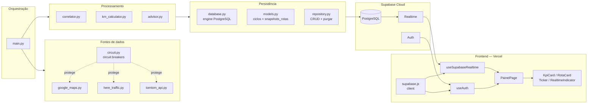
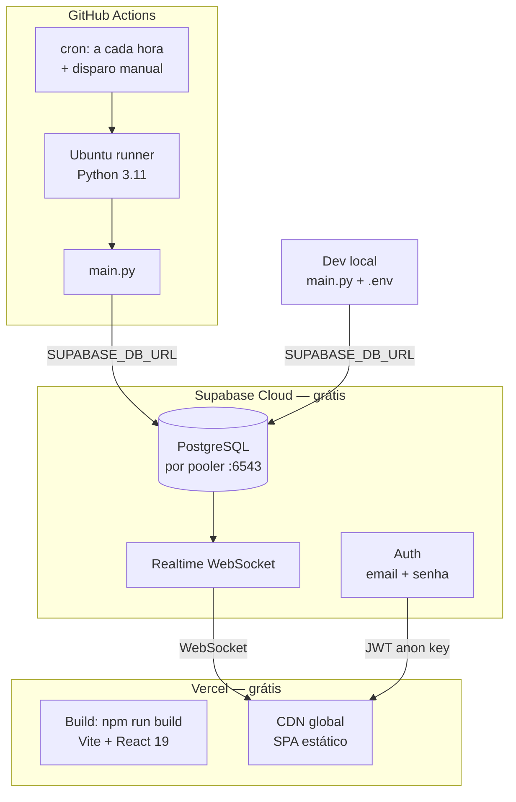
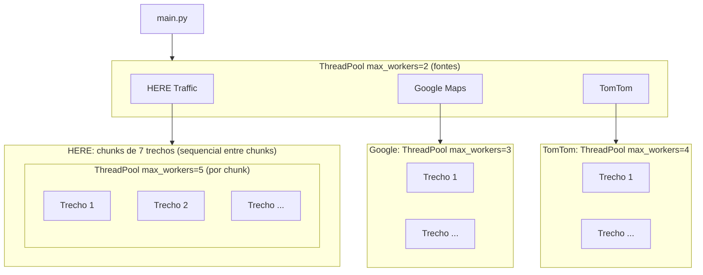

# Arquitetura — RodoviaMonitor Pro

> Versão atualizada: Mar 2026 | Sistema em produção com 20 rotas logísticas monitoradas.

---

## 1. Objetivo

Fornecer uma pipeline de monitoramento de trânsito para rotas logísticas, com coleta paralela de múltiplas fontes, correlação de sinais, persistência histórica em nuvem e painel web em tempo real.

---

## 2. Visão do sistema end-to-end



---

## 3. Fluxo de dados — sequência principal



---

## 4. Componentes por camada_



---

## 5. Arquitetura de deploy



> **Custo:** $0/mês. Sem servidor próprio, sem VPS, sem container gerenciado.

---

## 6. Contexto do sistema

### Entradas

| Origem | Conteúdo |
|--------|----------|
| `config.json` | APIs habilitadas, chunk_size, chunk_delay_s, agendamento |
| `rota_logistica.json` | 20 rotas (R01–R20) com hubs, waypoints, rodovia_logica, limite_gap_km |
| Variáveis de ambiente | `GOOGLE_MAPS_API_KEY`, `HERE_API_KEY`, `TOMTOM_API_KEY`, `SUPABASE_DB_URL` |

### Saídas

| Destino | Conteúdo |
|---------|----------|
| Supabase `ciclos` | Registro por execução (ts, fontes ativas, total de trechos) |
| Supabase `snapshots_rotas` | Status + ocorrência + atraso + confiança por trecho e ciclo |
| Excel em `relatorios/` | Planilha completa com todos os trechos (gerado localmente) |
| Painel Vercel | Dashboard em tempo real via Realtime/polling |

---

## 7. Responsabilidades por módulo

| Módulo | Responsabilidade |
|--------|-----------------|
| `main.py` | CLI, carga de config, scheduler, polling, orquestração de coleta e persistência |
| `sources/google_maps.py` | Routes API v2 — duração, atraso, speedReadingIntervals, classificação de status |
| `sources/here_traffic.py` | Incidentes v7 + Flow v7 — corridor/bbox, chunking, RDP downsampling |
| `sources/tomtom_api.py` | Incidents v5 + Flow v4 — bbox por trecho, ponto médio para flow |
| `sources/km_calculator.py` | Estimativa de KM por haversine + interpolação; confiança espacial |
| `sources/correlator.py` | Priorização de status/ocorrência, detecção de conflito entre fontes |
| `sources/advisor.py` | Score de confiança (freshness exponencial + peso por fonte + operacional) |
| `sources/circuit.py` | Circuit breakers para APIs externas (fail_max=5, reset_timeout=60s) |
| `storage/database.py` | Engine PostgreSQL via SUPABASE_DB_URL (pooler :6543) |
| `storage/models.py` | Definição das tabelas `ciclos` e `snapshots_rotas` (SQLAlchemy Core) |
| `storage/repository.py` | CRUD: salvar_ciclo, buscar histórico, tendências, purgar antigos |
| `report/excel_generator.py` | Planilha Excel com status, ocorrências, confiança e links |
| `frontend/src/services/supabase.js` | Cliente Supabase (VITE_SUPABASE_URL + VITE_SUPABASE_ANON_KEY) |
| `frontend/src/hooks/useAuth.js` | Autenticação Supabase Auth (sessão, login, logout) |
| `frontend/src/hooks/useSupabaseRealtime.js` | WebSocket Realtime; desiste após 3 falhas → modo polling |
| `frontend/src/pages/PainelPage.jsx` | Dashboard: busca ciclo + snapshots; upsert por Realtime; KPIs |

---

## 8. Concorrência



> Entre chunks HERE há delay de `chunk_delay_s` (default 1.5 s) para respeitar rate limits.

---

## 9. Modelo de dados consolidado (por trecho)

Campos gerados após correlação e enriquecimento pelo DataAdvisor, persistidos em `snapshots_rotas`:

| Campo | Tipo | Origem |
|-------|------|--------|
| `trecho` | texto | rota_logistica.json |
| `rodovia` | texto | rota_logistica.json |
| `sentido` | texto | rota_logistica.json |
| `status` | texto | correlator (HERE Flow > TomTom > Google) |
| `ocorrencia` | texto | correlator (múltiplas categorias separadas por `;`) |
| `atraso_min` | número | Google Routes / HERE |
| `confianca_pct` | número 0–100 | DataAdvisor |
| `conflito_fontes` | booleano | correlator (`_detectar_conflito_fontes`) |
| `ts_iso` | texto ISO 8601 | main.py (timestamp do ciclo) |
| `ciclo_id` | inteiro FK | `ciclos.id` |

Campos presentes na correlação mas **não** persistidos no banco (apenas Excel/log):

- `jam_factor`, `jam_factor_max`, `segmentos_congestionados`, `pct_congestionado`
- `km_ocorrencia`, `trecho_especifico`, `localizacao_precisa`, `confianca_localizacao`
- `duracao_normal_min`, `duracao_transito_min`
- `acao_recomendada`, `fontes_utilizadas`, `conflito_detalhe`

---

## 10. Schema do banco (Supabase)

```sql
-- Tabela de ciclos de execução
CREATE TABLE ciclos (
    id         BIGSERIAL PRIMARY KEY,
    ts         TIMESTAMPTZ DEFAULT NOW(),
    ts_iso     TEXT NOT NULL DEFAULT '',
    fontes     JSONB,
    total_trechos INTEGER
);

-- Tabela de snapshots por trecho
CREATE TABLE snapshots_rotas (
    id              BIGSERIAL PRIMARY KEY,
    ciclo_id        BIGINT REFERENCES ciclos(id) ON DELETE CASCADE,
    trecho          TEXT,
    rodovia         TEXT,
    sentido         TEXT,
    status          TEXT,
    ocorrencia      TEXT,
    atraso_min      NUMERIC,
    confianca_pct   NUMERIC,
    conflito_fontes BOOLEAN,
    ts_iso          TEXT NOT NULL DEFAULT ''
);

-- Índices
CREATE INDEX ON snapshots_rotas (ts_iso);
CREATE INDEX ON snapshots_rotas (trecho, ts_iso);
```

> `snapshots_rotas` está publicada no canal `supabase_realtime` para push de INSERTs ao frontend.

---

## 11. Resiliência e segurança

| Mecanismo | Onde | Configuração |
|-----------|------|-------------|
| Retry HTTP | urllib3.Retry | 429 e 5xx; backoff automático |
| Circuit breaker | `circuit.py` | fail_max=5, reset_timeout=60s por fonte |
| Validação JSON | antes do parse | evita falha por resposta vazia ou HTML de erro |
| Sanitização de logs | em todos os módulos | API keys nunca aparecem em stdout/stderr |
| Pool pre_ping | database.py | detecta conexões mortas com Supabase |
| Timeout GitHub Actions | monitor.yml | timeout-minutes: 20 |

---

## 12. Legado — não usar em features novas

| Componente | Motivo para não usar |
|------------|---------------------|
| `web/app.py` (FastAPI) | Substituído pelo GitHub Actions + Supabase |
| `useSse.js` / `SseIndicator` | Substituído por `useSupabaseRealtime` + `RealtimeIndicator` |
| `services/api.js` | Substituído pelo cliente Supabase direto |

---

## 13. Documentação relacionada

- [COMO_FUNCIONA.md](COMO_FUNCIONA.md) — guia completo do sistema (início recomendado)
- [ALGORITMOS.md](ALGORITMOS.md) — fluxogramas dos algoritmos internos
- [PRECISAO_E_CONFIANCA.md](PRECISAO_E_CONFIANCA.md) — gaps e % de confiança
- [ANALISE_PRECISAO.md](../ANALISE_PRECISAO.md) — análise técnica completa de precisão
- [GEOCODING_PRECISAO.md](GEOCODING_PRECISAO.md) — precisão de waypoints e geocoding
- [OPERACAO.md](OPERACAO.md) — guia operacional e troubleshooting
- [setup/](setup/) — deploy completo (Supabase, GitHub, Vercel)
