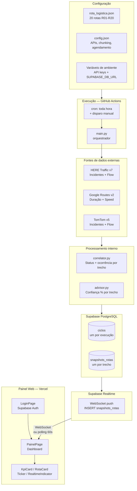
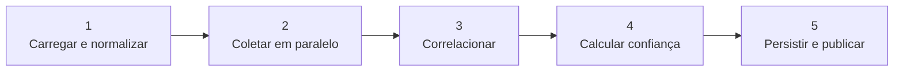
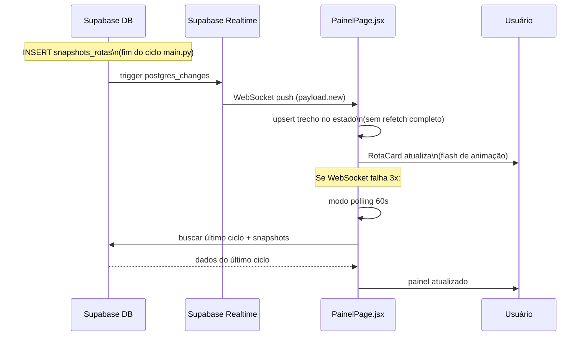

# Como funciona o RodoviaMonitor Pro

> Guia completo do sistema — do dado bruto ao painel web.
> Este é o ponto de entrada recomendado para entender ou apresentar o projeto.

---

## 1. Introdução

O **RodoviaMonitor Pro** monitora **20 rotas logísticas brasileiras** em tempo quase-real, coletando dados de trânsito e ocorrências de três fontes diferentes (HERE Traffic, Google Maps e TomTom), cruzando as informações e exibindo status, atrasos e incidentes em um painel web acessível via browser.

**Propósito:** dar visibilidade operacional a motoristas, despachantes e gestores de frota sobre o estado das rodovias — engarrafamentos, interdições, colisões, obras — com estimativa de atraso em minutos e localização por KM.

**Stack principal:**

| Camada | Tecnologia | Onde roda |
|--------|-----------|-----------|
| Coleta de dados | Python 3.11 (`main.py`) | GitHub Actions (cron) |
| Banco de dados | Supabase PostgreSQL | Supabase Cloud |
| Tempo real | Supabase Realtime (WebSocket) | Supabase Cloud |
| Autenticação | Supabase Auth | Supabase Cloud |
| Frontend | React 19 + Vite 7 | Vercel CDN |

**Custo:** $0/mês. Sem servidor próprio, sem VPS, sem container gerenciado.

---

## 2. Arquitetura em uma página



---

## 3. De onde vêm os dados

### 3.1 Configuração

| Arquivo | O que define |
|---------|-------------|
| `rota_logistica.json` | As 20 rotas (R01–R20): hubs de origem/destino com lat/lng, waypoints intermediários (`via`), nome lógico da rodovia (ex: "BR-101"), limite de gap para identificação de trecho local |
| `config.json` | Quais APIs estão habilitadas, tamanho do chunk HERE (`chunk_size: 7`), delay entre chunks (`chunk_delay_s: 1.5`), pasta de saída do Excel, horários de agendamento |
| Variáveis de ambiente | `GOOGLE_MAPS_API_KEY`, `HERE_API_KEY`, `TOMTOM_API_KEY` (coleta) e `SUPABASE_DB_URL` (banco) |

### 3.2 Execução

- **Automática:** GitHub Actions executa `main.py` a cada hora via cron, também pode ser acionado manualmente pelo GitHub UI ou via CLI (`gh workflow run`).
- **Local:** `python main.py --config config.json` com um arquivo `.env` contendo as chaves.

### 3.3 APIs de tráfego

| API | O que fornece | Cobertura |
|-----|--------------|-----------|
| **HERE Traffic v7** | Incidentes (tipo, descrição, coordenadas) + Flow (Jam Factor, velocidade) | Fonte principal — melhor cobertura Brasil |
| **Google Routes v2** | Duração com/sem trânsito + `speedReadingIntervals` | Atraso em minutos; bom para rotas longas |
| **TomTom v5/v4** | Incidentes (categoryFilter) + Flow (segmento de ponto médio) | Confirmação; TomTom Flow usa ponto médio |

---

## 4. Pipeline em 5 passos



### Passo 1 — Carregar e normalizar

`main.py` lê `config.json` e `rota_logistica.json`. Cada rota passa por `_normalizar_rota_logistica()` que converte o formato JSON para o formato interno usado na coleta: origem/destino como `"lat,lng"`, lista de waypoints, segmentos com pontos de referência (km + lat/lng + nome do local).

→ Veja [ALGORITMOS.md — Seção 1](ALGORITMOS.md#1-normalização-de-rotas)

### Passo 2 — Coletar em paralelo

As três fontes são disparadas simultaneamente em threads separadas. A HERE adiciona um nível de chunking: os 20 trechos são processados em blocos de 7 (com delay de 1.5 s entre blocos para respeitar rate limits), e dentro de cada bloco há até 5 threads simultâneas.

→ Veja [ALGORITMOS.md — Seção 2](ALGORITMOS.md#2-coleta-paralela-e-chunking)

### Passo 3 — Correlacionar por trecho

`correlator.py` recebe os dados das três fontes e, para cada trecho, decide:

- **Status** (Normal, Moderado, Intenso, Parado, Sem dados): prioridade HERE Flow → TomTom → Google, com promoção de status por jam localizado.
- **Ocorrência**: score por categoria (interdição, colisão, obras, engarrafamento...), com múltiplas categorias separadas por `;`.
- **Conflito**: detectado quando HERE e Google divergem em ≥ 2 níveis de status.

→ Veja [ALGORITMOS.md — Seções 5, 6](ALGORITMOS.md#5-correlação-de-status-e-ocorrência)

### Passo 4 — Calcular confiança

`advisor.py` (DataAdvisor) calcula `confianca_pct` (0–100) para cada trecho combinando:
- **Freshness:** quão recente é o dado (decaimento exponencial).
- **Peso da fonte:** HERE > TomTom > Google.
- **Score operacional:** gravidade do status + precisão espacial (KM estimado) + nº de fontes.
- **Penalidade:** -20 ou -10 pontos se há conflito de fontes.

→ Veja [ALGORITMOS.md — Seção 7](ALGORITMOS.md#7-cálculo-de-confiança--dataadvisor) e [PRECISAO_E_CONFIANCA.md](PRECISAO_E_CONFIANCA.md)

### Passo 5 — Persistir e publicar

`repository.py` insere um registro em `ciclos` (identificador do ciclo de execução) e um registro por trecho em `snapshots_rotas`. O INSERT em `snapshots_rotas` dispara o Supabase Realtime, que envia um push WebSocket ao frontend — o painel atualiza em tempo real sem necessidade de refresh.

---

## 5. Como os dados chegam ao painel



### Componentes do painel

| Componente | Função |
|-----------|--------|
| `LoginPage` | Formulário email/senha via Supabase Auth |
| `PainelPage` | Orquestrador: busca inicial, Realtime, estado dos dados |
| `KpiCard` | Cards da sidebar: total, Normal, Moderado, Intenso, Parado, Sem dados |
| `RotaCard` | Card por trecho: status, rodovia, atraso, ocorrência, `confianca_pct`, badge "CONFLITO" |
| `Ticker` | Faixa inferior com rotas críticas (Intenso/Parado) em rolagem |
| `RealtimeIndicator` | Verde "Ao vivo" / cinza "Conectando..." / amarelo "Polling 60s" |
| `Clock` | Relógio na sidebar |

### Autenticação

- Login via Supabase Auth (email e senha).
- `useAuth` hook gerencia sessão: `getSession()` na montagem + `onAuthStateChange`.
- Rota `/` é protegida por `ProtectedRoute` — redireciona para `/login` se não autenticado.
- JWT `anon key` no frontend só permite leitura (RLS ativo no Supabase).

---

## 6. Algoritmos que importam

| Algoritmo | Onde | Resumo |
|-----------|------|--------|
| **Normalização de rotas** | `main.py` | Converte JSON → formato interno com pontos de referência por KM |
| **Corridor vs bbox** | `here_traffic.py` | Polyline precisa (25% rotas) ou retângulo (75%), com filtros de 150/500 m |
| **RDP downsampling** | `here_traffic.py` | Simplifica polyline preservando curvas (epsilon crescente) |
| **Correlação de status** | `correlator.py` | HERE > TomTom > Google, promoção por jam localizado |
| **Detecção de conflito** | `correlator.py` | Divergência ≥ 2 níveis → penalidade de confiança |
| **Confiança (DataAdvisor)** | `advisor.py` | 0.55×freshness×peso + 0.45×operacional − penalidade |
| **Estimativa de KM** | `km_calculator.py` | Haversine + interpolação; confiança reduz em gaps grandes |

→ Veja [ALGORITMOS.md](ALGORITMOS.md) para fluxogramas detalhados de cada um.

---

## 7. Precisão e confiança

### O que é `confianca_pct`

Um número de 0 a 100 que combina:
- Frescor do dado (quão recente é a informação)
- Confiabilidade da fonte (HERE > TomTom > Google)
- Gravidade e precisão espacial do evento

> **Não é** a probabilidade de que o status seja correto — é um indicador operacional. Alta confiança significa que o dado é recente, vem de uma fonte confiável e tem localização precisa.

### Onde há imprecisão

| Fator | Impacto |
|-------|---------|
| 75% das rotas usam bbox (retângulo) | Risco de capturar incidentes de vias adjacentes |
| Distância KM é haversine (linha reta) | ±10–20 km em serras/curvas |
| HERE sempre sobrescreve status | Mesmo se Google detecta atraso maior |
| Waypoints amostrados da polyline | Podem estar levemente deslocados da rodovia real |

### Badge "CONFLITO" no painel

Quando `conflito_fontes = true` no RotaCard, significa que HERE e Google divergem significativamente (ex.: HERE diz "Normal", Google diz "Intenso"). O status exibido é o da HERE, mas a confiança é penalizada e o operador deve considerar ambas as informações.

→ Veja [PRECISAO_E_CONFIANCA.md](PRECISAO_E_CONFIANCA.md) para fórmulas e tabelas completas.
→ Veja [ANALISE_PRECISAO.md](../ANALISE_PRECISAO.md) para análise técnica com histórico de melhorias.

---

## 8. Onde está o quê

### Estrutura de arquivos

```
monitor-rodovias/
├── main.py                  ← orquestrador CLI (coleta + persistência)
├── config.json              ← configuração de APIs e agendamento
├── rota_logistica.json      ← 20 rotas R01–R20 com waypoints HERE
├── ANALISE_PRECISAO.md      ← análise técnica completa de precisão
│
├── sources/                 ← clientes das APIs de tráfego
│   ├── google_maps.py       ← Google Routes API v2
│   ├── here_traffic.py      ← HERE Traffic v7 (incidentes + flow)
│   ├── tomtom_api.py        ← TomTom Incidents v5 + Flow v4
│   ├── correlator.py        ← correlação de status/ocorrência entre fontes
│   ├── advisor.py           ← DataAdvisor: cálculo de confiança %
│   ├── km_calculator.py     ← estimativa de KM e trecho local
│   └── circuit.py           ← circuit breakers por API
│
├── storage/                 ← persistência Supabase PostgreSQL
│   ├── database.py          ← engine SQLAlchemy (SUPABASE_DB_URL)
│   ├── models.py            ← tabelas ciclos + snapshots_rotas
│   └── repository.py        ← CRUD + purgar antigos
│
├── report/
│   └── excel_generator.py   ← geração de relatório Excel
│
├── .github/workflows/
│   └── monitor.yml          ← GitHub Actions: cron horário
│
├── frontend/                ← React 19 + Vite 7 (deploy Vercel)
│   └── src/
│       ├── services/
│       │   └── supabase.js  ← cliente Supabase
│       ├── hooks/
│       │   ├── useAuth.js   ← autenticação Supabase Auth
│       │   └── useSupabaseRealtime.js  ← WebSocket + polling fallback
│       ├── components/      ← KpiCard, RotaCard, Ticker, RealtimeIndicator, Clock
│       └── pages/           ← LoginPage, PainelPage
│
└── docs/                    ← documentação (você está aqui)
    ├── COMO_FUNCIONA.md     ← este arquivo
    ├── ARQUITETURA.md       ← diagramas de componentes e deploy
    ├── ALGORITMOS.md        ← fluxogramas dos algoritmos
    ├── PRECISAO_E_CONFIANCA.md  ← gaps e % de confiança
    ├── GEOCODING_PRECISAO.md    ← precisão de waypoints e geocoding
    ├── OPERACAO.md          ← guia operacional e troubleshooting
    └── setup/               ← guias de deploy (Supabase, GitHub, Vercel)
```

### Guia rápido por necessidade

| Necessidade | Onde ir |
|------------|---------|
| Entender a arquitetura e componentes | [ARQUITETURA.md](ARQUITETURA.md) |
| Entender um algoritmo específico | [ALGORITMOS.md](ALGORITMOS.md) |
| Entender a confiança e precisão | [PRECISAO_E_CONFIANCA.md](PRECISAO_E_CONFIANCA.md) |
| Análise técnica detalhada de precisão | [ANALISE_PRECISAO.md](../ANALISE_PRECISAO.md) |
| Precisão de waypoints e geocoding | [GEOCODING_PRECISAO.md](GEOCODING_PRECISAO.md) |
| Rotina operacional e troubleshooting | [OPERACAO.md](OPERACAO.md) |
| Fazer deploy (Supabase + GitHub + Vercel) | [setup/](setup/) |
| Comandos rápidos (dev, build, coleta) | [README.md](../README.md) |

---

## 9. Leitura recomendada

Para quem está conhecendo o projeto agora, siga esta ordem:

1. **Este documento** — visão geral do sistema (você está aqui)
2. [ARQUITETURA.md](ARQUITETURA.md) — componentes, diagramas de sequência e deploy
3. [ALGORITMOS.md](ALGORITMOS.md) — como funcionam corridor/bbox, correlação, confiança e KM
4. [PRECISAO_E_CONFIANCA.md](PRECISAO_E_CONFIANCA.md) — gaps, fórmulas e limites do sistema
5. [OPERACAO.md](OPERACAO.md) — como rodar, monitorar e resolver problemas
6. [setup/01-SUPABASE.md](setup/01-SUPABASE.md) a [setup/04-TESTE-FINAL.md](setup/04-TESTE-FINAL.md) — deploy em produção

Para aprofundar em precisão e melhorias implementadas:

- [ANALISE_PRECISAO.md](../ANALISE_PRECISAO.md) — análise técnica completa com histórico das 10 melhorias
- [GEOCODING_PRECISAO.md](GEOCODING_PRECISAO.md) — limitações de geocoding e snap-to-road
