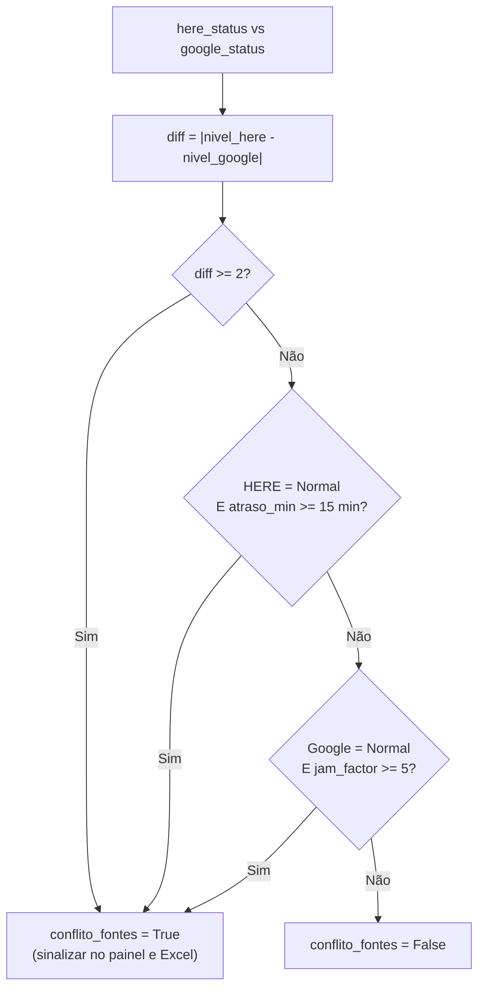

# Precisão e Confiança — RodoviaMonitor Pro
> Resumo executivo dos gaps de precisão, fórmulas de confiança e limites do sistema.
> Para análise técnica completa com histórico de melhorias, veja [ANALISE_PRECISAO.md](../ANALISE_PRECISAO.md).
> Para entender os algoritmos por trás, veja [ALGORITMOS.md](ALGORITMOS.md).

---

## 1. Onde há imprecisão — visão do pipeline

O dado passa por 8 estágios entre a API externa e o painel web. Em cada estágio há potencial de perda ou degradação de precisão:

```mermaid
flowchart LR
    apis["APIs externas\nHERE / Google / TomTom"]
    corridor["Corridor ou BBox\n(filtro espacial)"]
    rdp["RDP Downsampling\n(simplificação polyline)"]
    filtroTxt["Filtro texto\n(código da rodovia)"]
    filtroHav["Filtro haversine\n(distância à rota)"]
    correlator["Correlação\n(prioridade HERE > Google)"]
    km["Estimativa KM\n(haversine + interpolação)"]
    advisor["DataAdvisor\n(confiança % )"]
    saida6["Supabase / Excel\nPainel web"]

    apis -->|"Gap 1:\n25% corridor\n75% bbox"| corridor
    corridor -->|"Gap 2:\nRDP pode perder\ncurvas (mitigado)"| rdp
    rdp -->|"Gap 3:\nfiltra rodovias\nsó por texto"| filtroTxt
    filtroTxt -->|"Gap 4:\nvias adjacentes\n< 500m passam"| filtroHav
    filtroHav -->|"Gap 5:\nHERE sempre\nsobrescreve"| correlator
    correlator -->|"Gap 6:\n±2–20 km\nem trechos sinuosos"| km
    km -->|"Gap 7:\nconfianca_loc\nnão propagada"| advisor
    advisor --> saida6
```



---

## 2. Gaps principais

### 2.1 Corridor vs BBox — o gap mais impactante

| Método | % de rotas | Filtro espacial | Precisão |
|--------|-----------|----------------|----------|
| **Corridor** | ~25% | 150 m da polyline real | Alta |
| **BBox** | ~75% | 500 m da polyline de referência | Média |

**Por que a maioria usa bbox?** A HERE Traffic API aceita no máximo 300 pontos e 1.200 caracteres por corridor. Rotas longas (> 500 km) ou com muitas curvas excedem esse limite mesmo após simplificação RDP.

**Risco do bbox:** incidentes em rodovias paralelas a menos de 500 m podem ser capturados como se fossem na rota monitorada.

### 2.2 Precisão de KM (km_calculator)

| Tipo de trecho | Precisão esperada |
|---------------|-------------------|
| Trecho reto com pontos densos (gap < 20 km) | ±2–5 km |
| Trecho sinuoso (ex: serras) | ±10–20 km |
| Gap entre pontos > 60 km | Fallback "próximo a X" |
| Gap entre pontos > 120 km | Confiança reduzida 40% |

> **Causa:** a estimativa usa distância em linha reta (haversine), não ao longo da rodovia. Em serras com curvas, a distância real pode ser 2–3× a linha reta.

### 2.3 Rotas por nível de precisão geral

| Nível | Quantidade | Critério |
|-------|-----------|----------|
| **Alta** | 5 rotas | Metropolitanas + corridor + gaps < 20 km |
| **Média** | 16 rotas | Corridor ou gaps moderados (20–60 km) |
| **Baixa** | 6 rotas | BBox + gaps 20–60 km residuais |
| **Muito baixa** | 1 rota | BR-230 Transamazônica (gaps ~300 km) |

### 2.4 Waypoints — deslocamento de posição

Os waypoints em `rota_logistica.json` foram gerados por amostragem da polyline HERE (Routing v8). Após simplificação (RDP) ou atualização da rede viária HERE, podem ficar deslocados:

- Waypoint a dezenas de metros da rodovia pode cair em outro segmento de via.
- Matching HERE/TomTom é por **segmento de via** — deslocamento pequeno pode gerar "Sem dados" ou incidente no trecho errado.
- **Solução recomendada:** snap-to-road (Mapbox Map Matching, HERE, OpenRouteService) para alinhar waypoints à rede viária.

### 2.5 "Acurácia 100%" é inatingível

- Diferentes provedores (HERE, TomTom, Google) segmentam a mesma via de forma diferente.
- Obras, desvios e mudanças de sentido têm delay de atualização.
- Um "engarrafamento" pode ocupar 1 segmento em HERE e 2 em TomTom.
- **Meta realista:** maximizar precisão com os filtros existentes e documentar limitações.

---

## 3. Fórmula de confiança numérica — confianca_pct

**Arquivo:** `sources/advisor.py` — `DataAdvisor.enriquecer_dados()`

```
confianca_pct = (0.55 × base_conf) + (0.45 × op_conf)

onde:
  base_conf   = freshness_score × peso_fonte × 100
  op_conf     = gravidade_status + precisao_espacial + bonus_nfontes

Penalidade por conflito:
  conflito alto     → -20 pts
  conflito moderado → -10 pts

Resultado: 0 – 100 (inteiro)
```

### Freshness score (decaimento exponencial)

```
freshness = e^(-0.023 × age_minutes)

age = 0 min  → freshness = 1.000
age = 5 min  → freshness = 0.891
age = 15 min → freshness = 0.708
age = 30 min → freshness = 0.502
age = 60 min → freshness = 0.252
```

> Substituiu cutoffs abruptos (ex.: "dados com 15 min = 0.8; dados com 16 min = 0.5"). O decaimento exponencial é contínuo e sem saltos.

### Pesos por fonte

| Fonte | Peso |
|-------|------|
| HERE — incidentes | 1.00 |
| HERE — flow | 0.90 |
| TomTom — incidentes | 0.90 |
| TomTom — flow | 0.85 |
| Google — duração | 0.80 |

### Score operacional

| Componente | Pontuação |
|-----------|-----------|
| Status "Parado" | 90 pts |
| Status "Intenso" | 70 pts |
| Status "Moderado" | 50 pts |
| Status "Normal" | 30 pts |
| + km_estimado disponível | +15 pts |
| + trecho_especifico definido | +10 pts |
| + localizacao_precisa disponível | +5 pts |
| + cada fonte adicional | +5 pts |

---

## 4. Confiança textual — Alta / Média / Baixa

Derivada do `confianca_pct` e exibida no correlator e no Excel:

| confianca_pct | Confiança textual |
|--------------|------------------|
| ≥ 70 | **Alta** |
| 40 – 69 | **Média** |
| < 40 | **Baixa** |

### Rebaixo por conflito de fontes

Quando HERE e Google divergem em ≥ 2 níveis de status:

```
Alta  → Média  (rebaixo 1 nível)
Média → Baixa  (rebaixo 1 nível)
```

> Independente do valor numérico — conflito de fontes sempre indica incerteza, mesmo que ambas as fontes tenham dados frescos.

---

## 5. Confiança espacial — confianca_localizacao

**Arquivo:** `sources/km_calculator.py` — `_calcular_confianca()`

Calculada durante a estimativa de KM de cada incidente:

```
confianca_loc = 1.0  (base)

Se gap_km > 120:  confianca_loc *= 0.6   (-40%)
Se gap_km > 80:   confianca_loc *= 0.75  (-25%)
Se dist_min > 50 km (MAX_DISTANCIA_REFERENCIA_KM): confianca_loc = 0.2
```

**Limitação atual:** `confianca_localizacao` é calculada mas **não é propagada** para o `DataAdvisor`. Ela aparece no Excel (como % na coluna KM/Local com color-code) mas não influencia o `confianca_pct` final. Documentado como limitação residual no [ANALISE_PRECISAO.md](../ANALISE_PRECISAO.md#63-confianca-de-localizacao--nao-propagada).

---

## 6. Conflito de fontes

### Quando é detectado



### O que acontece quando há conflito

| Consequência | Detalhe |
|-------------|---------|
| `conflito_fontes = True` | Campo no banco e no RotaCard do painel |
| Badge "CONFLITO" no painel | Exibido no RotaCard quando `conflito_fontes = true` |
| Penalidade numérica | -20 pts (alto) ou -10 pts (moderado) no `confianca_pct` |
| Confiança textual rebaixada | Alta → Média, ou Média → Baixa |
| Observação no Excel | "⚠ Fontes divergem: HERE indica X mas Google indica Y" |
| Log WARNING | Emitido para monitoramento |

> **Status final não muda:** HERE ainda sobrescreve. O conflito é sinalizado, mas o operador decide com base no alerta se deve confiar mais em uma fonte ou aguardar próximo ciclo.

---

## 7. Tabela resumo — perda por estágio do pipeline

Adaptada de [ANALISE_PRECISAO.md — Seção 10](../ANALISE_PRECISAO.md#10-resumo-quantitativo):

| Estágio | Perda estimada | Causa | Mitigação |
|---------|---------------|-------|-----------|
| Corridor → BBox (75% rotas) | Moderada | Polyline > 1.200 chars / 300 pts | Filtro haversine 500 m via polyline de referência |
| Polyline downsampling | Baixa | Simplificação geométrica | RDP preserva curvas e inflexões |
| Filtro de rodovia (texto) | Variável | HERE pode não incluir nome da via | Filtro haversine complementar |
| Filtro distância (bbox) | Baixa | Vias adjacentes < 500 m | Combinado com filtro texto |
| Jam Factor (média diluída) | Baixa | Congestionamento localizado some na média | `jam_factor_max` + `segmentos_congestionados` |
| `speedReadingIntervals` Google | Baixa | Zonas proporcionais, não KM exatos | `_analisar_speed_intervals()` enriquece observações |
| Correlação (status) | Baixa | HERE sobrescreve sempre | Conflito sinalizado + promoção por segmento |
| KM positioning | Moderada | Haversine ≠ distância pela rodovia | Pontos de referência intermediários adicionados |
| Confiança | Baixa | Fórmula parcialmente circular | Decaimento exponencial + penalidade por conflito |

---

## 8. Recomendações para aumentar precisão

| Recomendação | Impacto | Complexidade |
|-------------|---------|-------------|
| Snap-to-road nos waypoints (Mapbox/HERE Map Matching) | Alto | Médio |
| Decodificar polyline Google para KM exatos (não proporcionais) | Médio | Alto |
| Propagar `confianca_localizacao` ao DataAdvisor | Médio | Baixo |
| Validação de waypoints por reverse geocoding | Médio | Baixo |
| Rotas alternativas Google (`computeAlternativeRoutes: True`) | Baixo | Baixo |
| Velocidade por segmento individual (speed/freeFlow HERE) | Baixo | Médio |

---

## Documentação relacionada

- [ANALISE_PRECISAO.md](../ANALISE_PRECISAO.md) — análise técnica completa com histórico de melhorias (#1–#10)
- [GEOCODING_PRECISAO.md](GEOCODING_PRECISAO.md) — precisão de geocoding e waypoints
- [ALGORITMOS.md](ALGORITMOS.md) — fluxogramas dos algoritmos
- [COMO_FUNCIONA.md](COMO_FUNCIONA.md) — guia geral do sistema
