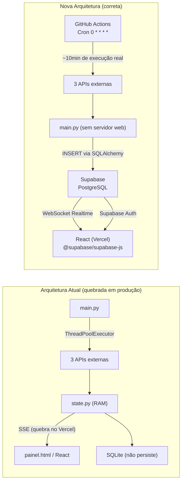
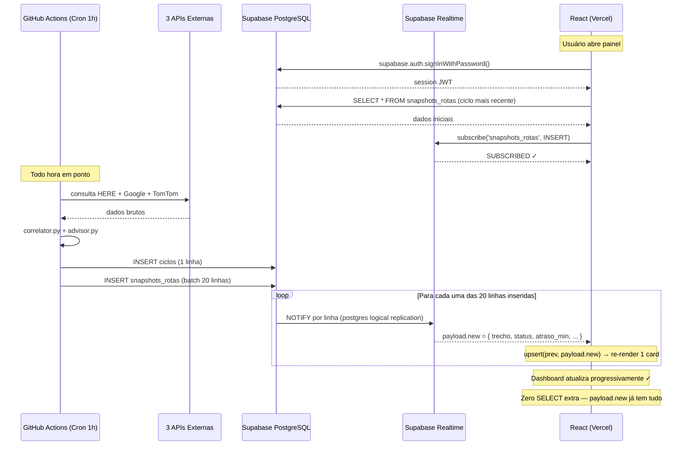

# Plano de Deploy: GH Actions → Supabase → Vercel

## Validação da Arquitetura Proposta

**Sua análise está correta.** O SSE exige conexão HTTP longa e persistente — isso é fisicamente impossível em qualquer ambiente serverless (Vercel, Lambda, Cloud Functions). Substituir por Supabase Realtime (WebSocket via PostgreSQL LISTEN/NOTIFY) é a solução certa pelo seguinte raciocínio:




**Por que o Supabase Realtime funciona onde o SSE falha:**

- SSE = o **servidor** mantém conexão aberta → impossível em serverless
- Supabase Realtime = o **banco** envia eventos via WebSocket direto para o cliente → o "servidor" é o Supabase, que roda 24/7 de forma gerenciada
- O frontend conecta direto ao Supabase, sem passar pelo seu backend

---

## Impacto em cada camada

### O que some completamente


| Arquivo/Módulo                                              | Motivo                                         |
| ----------------------------------------------------------- | ---------------------------------------------- |
| `web/state.py`                                              | Estado em RAM substituído pelo banco           |
| `web/app.py` (endpoint `/events`)                           | SSE eliminado                                  |
| `web/app.py` (endpoints `/api/status`, `/api/resumo`, etc.) | Frontend lê direto do Supabase                 |
| `api/index.py` (Mangum serverless)                          | Sem Python na Vercel                           |
| `src/hooks/useSse.js`                                       | Substituído por `useSupabaseRealtime.js`       |
| `src/components/SseIndicator.jsx`                           | Substituído por indicador de conexão WebSocket |
| `notifications/`                                            | Já removido pelo usuário                       |


### O que muda de forma mínima


| Arquivo                 | Mudança                                                        |
| ----------------------- | -------------------------------------------------------------- |
| `storage/database.py`   | String de conexão: SQLite → PostgreSQL (Supabase URL)          |
| `storage/repository.py` | Remove pragmas SQLite; sem `metadata.create_all()`             |
| `main.py`               | Remove `_iniciar_servidor_web()` e `_iniciar_storage()` SQLite |
| `vercel.json`           | Remove build Python; apenas frontend estático                  |


### O que é criado do zero

- `.github/workflows/monitor.yml` — worker de coleta agendado
- `src/services/supabase.js` — cliente Supabase no frontend
- `src/hooks/useSupabaseRealtime.js` — substitui `useSse.js`
- Tabelas e políticas RLS no painel do Supabase

---

## Passo 1 — Configurar Supabase

### 1.1 Criar projeto e tabelas

No painel do Supabase (`supabase.com`), criar as tabelas equivalentes ao schema atual:

```sql
-- ciclos: metadados de cada execução do GH Actions
create table ciclos (
  id          bigint primary key generated always as identity,
  ts          text   not null,
  ts_iso      text   not null,
  fontes      text   not null default '[]',
  total_trechos integer not null default 0
);
create index idx_ciclos_ts_iso on ciclos (ts_iso desc);

-- snapshots_rotas: estado de cada trecho
create table snapshots_rotas (
  id              bigint primary key generated always as identity,
  ciclo_id        bigint references ciclos(id) on delete cascade,
  trecho          text    not null,
  rodovia         text,
  sentido         text,
  status          text    not null,
  ocorrencia      text,
  atraso_min      float,
  confianca_pct   float,   -- float, não integer (corrige bug identificado antes)
  conflito_fontes integer not null default 0,
  ts_iso          text    not null
);
create index idx_sr_trecho_ts on snapshots_rotas (trecho, ts_iso desc);
create index idx_sr_ts_iso    on snapshots_rotas (ts_iso desc);
```

### 1.2 Habilitar Supabase Realtime

No painel: **Database → Replication → Tables → `snapshots_rotas` → Enable**

Isso ativa o `pg_logical_replication` para a tabela. A partir daí, todo `INSERT` na tabela dispara um evento WebSocket para os clientes conectados.

### 1.3 Configurar Row Level Security (RLS)

O Supabase expõe dados via API REST e Realtime. Para proteger:

```sql
-- Habilitar RLS nas tabelas
alter table ciclos          enable row level security;
alter table snapshots_rotas enable row level security;

-- Política: somente usuários autenticados leem os dados
create policy "Leitura autenticada"
  on snapshots_rotas for select
  using (auth.role() = 'authenticated');

create policy "Leitura autenticada ciclos"
  on ciclos for select
  using (auth.role() = 'authenticated');
```

### 1.4 Autenticação via Supabase Auth

O `auth.py` (JWT + bcrypt) é substituído pelo Supabase Auth. No painel:

- **Authentication → Users → Invite User** → criar o usuário operador
- O `LoginPage.jsx` usa `supabase.auth.signInWithPassword()` em vez de `POST /api/auth/login`
- O token JWT é gerenciado pelo SDK do Supabase (cookie/localStorage automático)

### 1.5 Credenciais necessárias


| Variável            | Onde usar             | Como obter                                       |
| ------------------- | --------------------- | ------------------------------------------------ |
| `SUPABASE_URL`      | Frontend (env Vercel) | Painel → Settings → API                          |
| `SUPABASE_ANON_KEY` | Frontend (env Vercel) | Painel → Settings → API (chave pública)          |
| `SUPABASE_DB_URL`   | GH Actions secrets    | Painel → Settings → Database → Connection string |


---

## Passo 2 — Adaptar o Backend (main.py + storage)

### 2.1 `storage/database.py`

```python
# ANTES: SQLite com WAL mode
engine = create_engine(f"sqlite:///{caminho}", connect_args={...})

# DEPOIS: PostgreSQL via variável de ambiente
import os
from sqlalchemy import create_engine

def get_engine():
    url = os.environ["SUPABASE_DB_URL"]  # falha explicitamente se ausente
    return create_engine(url, pool_pre_ping=True)
```

### 2.2 `storage/repository.py`

Remover apenas:

- `metadata.create_all(engine)` do `__init__` (tabelas gerenciadas pelo Supabase)
- A docstring "SQLite via SQLAlchemy Core" → "PostgreSQL via SQLAlchemy Core"

O resto do código funciona sem mudanças — SQLAlchemy Core é agnóstico ao banco.

### 2.3 `main.py`

Remover:

- Bloco `_iniciar_servidor_web()` (FastAPI/uvicorn)
- Bloco de inicialização do `_alert_engine`
- Imports de `web.*`

Manter:

- Toda a lógica de coleta (`executar_coleta`, `_coletar_fonte`)
- `_iniciar_storage()` → agora conecta ao PostgreSQL
- Geração do Excel (se mantida) ou remover também

### 2.4 `requirements.txt`

Adicionar:

```
psycopg2-binary>=2.9.0
```

Remover (não usados no worker):

```
fastapi, uvicorn, mangum, sse-starlette, PyJWT, bcrypt
```

---

## Passo 3 — GitHub Actions Workflow

### Repositório público = minutos ilimitados e 100% gratuitos

**Confirmado pela documentação oficial do GitHub (fev/2026):**

> *"The use of standard GitHub-hosted runners is free: ... In public repositories"*

Para repositórios públicos com runners standard (`ubuntu-latest`), **não existe cota de minutos**. O limite de 2.000 min/mês aplica-se exclusivamente a repositórios **privados** no plano Free. Em 2025, desenvolvedores usaram 11,5 bilhões de minutos em projetos públicos gratuitamente — o GitHub confirma a continuidade desse modelo.

Isso significa:

- Cron `0 * * * *` (toda hora, 24/7) → **zero custo, sem restrição de horário**
- Execução de ~10 min/run → **nenhum impacto financeiro**
- Nenhuma necessidade de restringir intervalos ou horários

### Segurança de credenciais em repositório público

O YAML do workflow (`.github/workflows/monitor.yml`) ficará **visível publicamente** — qualquer um pode ler. Isso é completamente seguro porque o arquivo referencia apenas os **nomes** dos secrets, nunca os valores.


| Mecanismo                  | Detalhe                                                         |
| -------------------------- | --------------------------------------------------------------- |
| Criptografia em repouso    | Secrets armazenados com AES-256 nos servidores do GitHub        |
| Injeção em runtime         | O valor existe apenas na memória do runner durante a execução   |
| Redação automática de logs | GitHub substitui o valor por `*`** em qualquer log onde apareça |
| Sem acesso de forks        | Eventos `pull_request` de forks não recebem secrets por padrão  |
| Escopo restrito            | Somente workflows do próprio repositório acessam os secrets     |


**O que NUNCA deve estar no código ou arquivos commitados:**

- `.env` com valores reais → já está no `.gitignore` ✓
- Qualquer credencial hardcoded em `.py`, `.js`, `.json` ou `.yml`
- A `SUPABASE_DB_URL` (contém usuário e senha do banco)

**O que é seguro estar público (por design do Supabase):**

- `VITE_SUPABASE_URL` → URL pública do projeto
- `VITE_SUPABASE_ANON_KEY` → chave pública, protegida pelo RLS no banco

### Por que o timeout importa mesmo com minutos gratuitos

O README documenta `~68s por ciclo`, mas esse número cobre **apenas a coleta das APIs**. O tempo real do `main.py` completo é de aproximadamente **10 minutos**:

- **HERE Traffic** com `chunk_size: 7` e `chunk_delay_s: 1.5s` → múltiplos bboxes por rota
- **TomTom** com `submit_delay_s: 0.2s` → 20 rotas × 2 endpoints = 40 chamadas com delay
- **Excel generator** (592 linhas de openpyxl estilizado) → custo significativo de CPU
- Setup do runner Ubuntu → ~60-90s antes do script iniciar

`timeout-minutes: 10` seria fatal — mataria o processo durante a gravação no Supabase. O valor correto é `timeout-minutes: 20` como proteção contra travamento de APIs externas, não como limite de custo.

Criar `.github/workflows/monitor.yml`:

```yaml
name: Monitor de Rodovias

on:
  schedule:
    - cron: '0 * * * *'    # toda hora, 24/7 — 100% gratuito em repo público
  workflow_dispatch:         # disparo manual via painel do GitHub

jobs:
  coletar:
    runs-on: ubuntu-latest
    timeout-minutes: 20      # proteção contra travamento; execução normal ~10min

    steps:
      - uses: actions/checkout@v4

      - uses: actions/setup-python@v5
        with:
          python-version: '3.11'
          cache: 'pip'               # reduz setup de ~3min → ~30s por cached run
          cache-dependency-path: monitor-rodovias/requirements.txt

      - name: Instalar dependências
        run: pip install -r monitor-rodovias/requirements.txt

      - name: Executar coleta
        working-directory: monitor-rodovias
        env:
          GOOGLE_MAPS_API_KEY: ${{ secrets.GOOGLE_MAPS_API_KEY }}
          HERE_API_KEY:         ${{ secrets.HERE_API_KEY }}
          TOMTOM_API_KEY:       ${{ secrets.TOMTOM_API_KEY }}
          SUPABASE_DB_URL:      ${{ secrets.SUPABASE_DB_URL }}
        run: python main.py --config config.json
```

**Configurar secrets em:** `GitHub → repositório → Settings → Secrets and variables → Actions → New repository secret`


| Secret                | Valor                                                                     |
| --------------------- | ------------------------------------------------------------------------- |
| `GOOGLE_MAPS_API_KEY` | Chave do Google Cloud Console                                             |
| `HERE_API_KEY`        | Chave do HERE Developer                                                   |
| `TOMTOM_API_KEY`      | Chave do TomTom Developer                                                 |
| `SUPABASE_DB_URL`     | Supabase → Settings → Database → URI (porta **6543** — connection pooler) |


---

## Passo 4 — Adaptar o Frontend React

### 4.1 Adicionar Supabase ao projeto

```bash
cd frontend
npm install @supabase/supabase-js
```

### 4.2 `src/services/supabase.js` (novo)

```javascript
import { createClient } from '@supabase/supabase-js';

export const supabase = createClient(
  import.meta.env.VITE_SUPABASE_URL,
  import.meta.env.VITE_SUPABASE_ANON_KEY,
);
```

### 4.3 `src/hooks/useSupabaseRealtime.js` (substitui useSse.js)

**Otimização executiva aplicada:** o `payload.new` do WebSocket já contém a linha completa inserida. O React **não precisa fazer um SELECT extra** — injeta `payload.new` diretamente no estado. Isso elimina uma viagem de rede e torna a atualização instantânea.

**Comportamento por trecho:** o `repository.py` faz `conn.execute(insert(snapshots_rotas), rows)` — um batch INSERT com 20 linhas. O Supabase Realtime dispara **um evento por linha**, não um por statement. O frontend recebe 20 eventos `payload.new` em sequência rápida, cada um atualizando um trecho individualmente. O efeito visual é o painel se atualizando progressivamente, trecho a trecho — melhor UX que um único re-render de 20 itens.

```javascript
import { useEffect, useRef, useState } from 'react';
import { supabase } from '@/services/supabase';

export function useSupabaseRealtime(onTrechoUpdate) {
  const [status, setStatus] = useState('connecting');
  const channelRef = useRef(null);
  const callbackRef = useRef(onTrechoUpdate);

  // Mantém referência estável sem recriar o canal
  useEffect(() => { callbackRef.current = onTrechoUpdate; }, [onTrechoUpdate]);

  useEffect(() => {
    const channel = supabase
      .channel('snapshots_realtime')
      .on(
        'postgres_changes',
        { event: 'INSERT', schema: 'public', table: 'snapshots_rotas' },
        (payload) => {
          // payload.new já tem todos os campos da linha inserida
          // Não precisa de SELECT extra — injeta direto no estado
          callbackRef.current(payload.new);
        }
      )
      .subscribe((s) => {
        setStatus(s === 'SUBSCRIBED' ? 'connected' : 'connecting');
      });

    channelRef.current = channel;
    return () => { supabase.removeChannel(channel); };
  }, []);

  return { status };
}
```

### 4.4 `src/pages/LoginPage.jsx`

Substituir `login()` de `api.js` por:

```javascript
const { error } = await supabase.auth.signInWithPassword({ email, password });
```

### 4.5 `src/hooks/useAuth.js`

Substituir `getMe()` por:

```javascript
const { data: { session } } = await supabase.auth.getSession();
```

Supabase gerencia o token automaticamente (sem cookie HttpOnly manual).

### 4.6 `src/pages/PainelPage.jsx`

Substituir `useSse` por `useSupabaseRealtime`. O callback recebe `payload.new` (o trecho completo) e faz upsert no estado local — **sem SELECT extra**:

```javascript
const handleTrechoUpdate = useCallback((novoTrecho) => {
  setDados(prev => {
    const idx = prev.findIndex(d => d.trecho === novoTrecho.trecho);
    if (idx >= 0) {
      // Atualiza trecho existente no lugar
      const next = [...prev];
      next[idx] = novoTrecho;
      return next;
    }
    // Novo trecho (primeira carga ou trecho novo na configuração)
    return [...prev, novoTrecho];
  });
  setUltimoCiclo(novoTrecho.ts_iso);
}, []);

const { status: rtStatus } = useSupabaseRealtime(handleTrechoUpdate);
```

O carregamento inicial (quando o usuário abre o painel) ainda faz um SELECT para buscar o último ciclo completo — esse único SELECT na abertura é necessário e correto. Apenas as **atualizações subsequentes** via Realtime dispensam SELECT.

### 4.7 Remover arquivos obsoletos

- `src/hooks/useSse.js`
- `src/components/SseIndicator.jsx` e `SseIndicator.module.css`
- `src/services/api.js` (ou reduzir ao mínimo)

---

## Passo 5 — Simplificar o Vercel

### 5.1 `vercel.json` (novo)

```json
{
  "buildCommand": "cd frontend && npm install && npm run build",
  "outputDirectory": "frontend/dist",
  "framework": null
}
```

Sem Python, sem `@vercel/python`, sem routes para `/api/*` ou `/events`.

### 5.2 Variáveis de ambiente na Vercel

No painel Vercel → Settings → Environment Variables:


| Variável                 | Valor                               |
| ------------------------ | ----------------------------------- |
| `VITE_SUPABASE_URL`      | `https://xxxx.supabase.co`          |
| `VITE_SUPABASE_ANON_KEY` | `eyJ...` (chave pública, sem risco) |


---

## Fluxo final validado




---

## Ordem de execução das tarefas

- Criar projeto Supabase, executar SQL das tabelas, habilitar Realtime em `snapshots_rotas`
- Configurar Supabase Auth: criar usuário operador
- Configurar RLS (políticas de leitura autenticada)
- Adaptar `storage/database.py` para PostgreSQL
- Adaptar `storage/repository.py` (remover `create_all`, pragmas SQLite)
- Adaptar `main.py` (remover servidor web, alertas)
- Atualizar `requirements.txt` (add psycopg2-binary, remove fastapi/uvicorn/mangum)
- Criar `.github/workflows/monitor.yml`
- Testar workflow manualmente (`workflow_dispatch`) antes de ativar o cron
- Adicionar `@supabase/supabase-js` ao frontend
- Criar `src/services/supabase.js`
- Criar `src/hooks/useSupabaseRealtime.js`
- Adaptar `LoginPage.jsx` para Supabase Auth
- Adaptar `useAuth.js` para Supabase Auth
- Adaptar `PainelPage.jsx` para Supabase Realtime
- Remover `useSse.js`, `SseIndicator`
- Simplificar `vercel.json`
- Configurar env vars na Vercel (`VITE_SUPABASE_URL`, `VITE_SUPABASE_ANON_KEY`)
- Deploy final e smoke test

